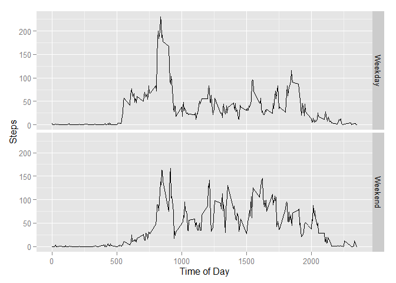

# Reproducible Research: Peer Assessment 1


## Loading and preprocessing the data
We will read into R the raw data. This data was obtained from the internet source shown by the url link shown below on March 4, 2015 at 2:35 pm.
https://d396qusza40orc.cloudfront.net/repdata%2Fdata%2Factivity.zip

The variables included in this dataset are:

* **steps**: Number of steps taking in a 5-minute interval (missing
    values are coded as `NA`)

* **date**: The date on which the measurement was taken in YYYY-MM-DD
    format

* **interval**: Identifier for the 5-minute interval in which
    measurement was taken


```r
ActivityData<-read.csv("./activity.csv", stringsAsFactors=F)
```

Note that all figures for this document are stored in the PA1_template_files/figure-html directory.

## What is mean total number of steps taken per day?

We will create an exploritory histogram of the average steps taken each day. We will also determine the mean and median of this data to obtain some idea about the underlying distribution of this data. For this exploration of the data we will ignore any missing values by using the defaults of our R functions.


```r
# now load the ggplot2 library
require(ggplot2)
```

```
## Loading required package: ggplot2
```

```r
#create a count plot by day that becomes a data based histogram by summing each day's steps
qplot(date,steps, data=ActivityData, stat="summary", fun.y="sum", geom="bar")
```

```
## Warning: Removed 2304 rows containing missing values (stat_summary).
```

 

```r
# now create a data fram by using aggregate to sum again by day
StepsSummed<-aggregate(steps~date,data=ActivityData,sum)
# lets determine the mean and median, then print them
StepsMean<-mean(StepsSummed$steps)
StepsMedian<-median(StepsSummed$steps)
StepsData<-cbind(StepsMean,StepsMedian)
print(StepsData)
```

```
##      StepsMean StepsMedian
## [1,]  10766.19       10765
```

```r
StepsMax<-StepsSummed[which.max(StepsSummed$steps),2]
print(StepsMax)
```

```
## [1] 21194
```

The mean and median are very close but the mode is significantly different. This would tend to indicate the underlying distribution is a skewed distribution and possibly not normal.

## What is the average daily activity pattern?

To determine the average daily activity pattern I first created a histogram of the sum of the steps taken averaged by time interval. Then I average the steps by interval into a new data frame using the aggregate r function. Finally the time interval with the maximum number of steps is extracted from this new data frame by using the which.max r function to identify they the row which contains this value and then reading the value contained in that specific steps column cell.


```r
# now lets aveage the steps by time interval by day (acepting defaults means NA is ignored)
qplot(interval,steps, data=ActivityData, stat="summary", fun.y="mean", geom="bar")
```

```
## Warning: Removed 2304 rows containing missing values (stat_summary).
```

 

```r
# not create the data frame of averaged values to report on and use later in imputing
StepsAveraged<-aggregate(steps~interval,data=ActivityData,mean)
# now find the time period that has the max by using which.max to find the right row in our data frame we created above
MaxStepsPeriod<-StepsAveraged[which.max(StepsAveraged[,2]),]
MaxStepsInterval<-MaxStepsPeriod[1,1]
print(MaxStepsInterval)
```

```
## [1] 835
```

The maximum number of steps averaged across all days occurs during interval 835 which corresponds to 8:35 AM. This makes intuitive sense because at this time many people would be either engaging in mornining exercise or commuting. Both of these activities would significantly increase their steps taken. 

## Imputing missing values

To replace the missing values I used a simple strategy of using the average for that time interval across all non-missing data to replace any missing values. The code loop for doing this is shown below and the plot of the data with the imputed values follows.To obtain the imputation values I used the steps averaged by interval previously created above to generate the daily activity pattern.

As had been done previously the imputed data is first plotted in a histogram format and then a new data frame with the steps summed by date is created. I extracted the mean and median of the steps column from this data frame and then print them.


```r
# now create a data frame equal to the original
ActivityDataImpute<-ActivityData
# now loop through the values and for every NA in steps replace it with the average for that time period from the data frame we created above (told you we would use it later)
for (i in 1:nrow(ActivityDataImpute)){
      if (is.na(ActivityDataImpute[i,1])==T){
            ActivityDataImpute[i,1]<-StepsAveraged[match(ActivityDataImpute[i,3],StepsAveraged[,1]),2]
      }
}
# now repeat the steps above that create the summary histogram and perform the calculations to determine and then print the mean and median values
require(ggplot2)
qplot(date,steps, data=ActivityDataImpute, stat="summary", fun.y="sum", geom="bar")
```

 

```r
StepsSummedImpute<-aggregate(steps~date,data=ActivityDataImpute,sum)
StepsMeanImpute<-mean(StepsSummedImpute$steps)
StepsMedianImpute<-median(StepsSummedImpute$steps)
StepsDataImpute<-cbind(StepsMeanImpute,StepsMedianImpute)
print(StepsDataImpute)
```

```
##      StepsMeanImpute StepsMedianImpute
## [1,]        10766.19          10766.19
```

As can be seen from these values of the mean and median are not significantly changed by this imputing of the missing values. This is because by using the mean of the intervals we do not change the mean or distribution of those intervals, we simply repeat the current mean. This also means that the mean and distribution of the overall data remains unchanged. The only consequence of such a imputation is the diluting of any subgroup correlations.


## Are there differences in activity patterns between weekdays and weekends?

To determine if there are differences between weekday and weekend patterns a time plot is produced using and indicator of weekday or weekend for the date and time of day for the x axis.

To ready the data for this plot the interval column values are converted to a time series object for ploting and stored in a new columne labeled intervalplot. The weekday name of the date is generated using the weekdays function operating on the date character column that is converted to a POSIX object using the r function strptime. These values are stored in a new column labled weekday.

A new column labled weekdayfactor is created empty with all NA values stored in it. This column is populated with the 1 if the weekday name matches the list of weekend day names and by a 0 otherwise. This column is converted to a factor variable using the factor function and given the two levels of Weekday and Weekend.

Finally the ggplot2 package is used to plot the average by time of day of the steps taken with plots for the weekdays and the weekend days.


```r
# now convert the interval character column to time series for plotting
ActivityDataImpute$intervalplot<-as.ts(ActivityDataImpute$interval)
#find the day of the week for each date
ActivityDataImpute$weekday<-weekdays(strptime(ActivityDataImpute$date,"%Y-%m-%d"))
# create an empty column
ActivityDataImpute$weekdayfactor<-NA
#populate the new column with the a 1 if the date is a weekend day or 0 if the date is a weekday
for (i in 1:nrow(ActivityDataImpute)){
      if (ActivityDataImpute[i,5]=="Sunday"|ActivityDataImpute[i,5]=="Saturday"){
            ActivityDataImpute[i,6]=1
      }
      else{
            ActivityDataImpute[i,6]=0
      }
}
#covert this to a factor variable
ActivityDataImpute$weekdayfactor<- factor(ActivityDataImpute$weekdayfactor, labels = c("Weekday", "Weekend"))
#create a plot using ggplot2 qplot function and use facets for weekday and weekend
qplot(intervalplot,steps, data=ActivityDataImpute, stat="summary", fun.y="mean", geom="line",facets=weekdayfactor~.,xlab="Time of Day",ylab="Steps")
```

 

The resulting plot clearly shows that this pattern of steps is different for weekdays and weekend days. The weekend activity starts later and ends later. This indicates that the act daily commuting on the weekdays impacts the steps taken.
